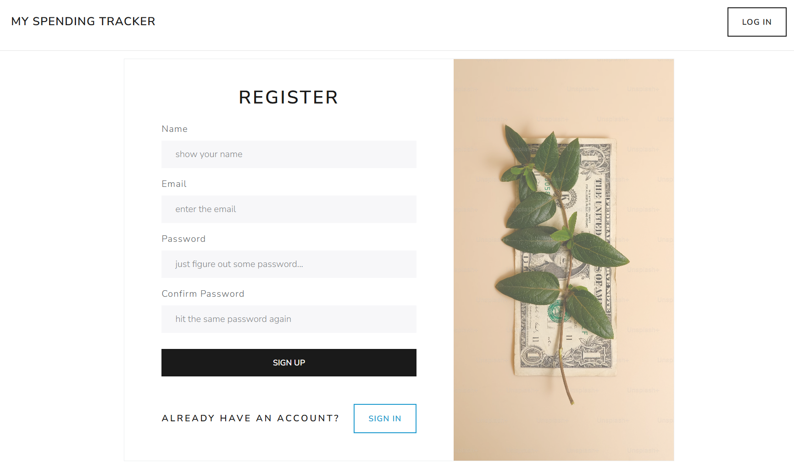
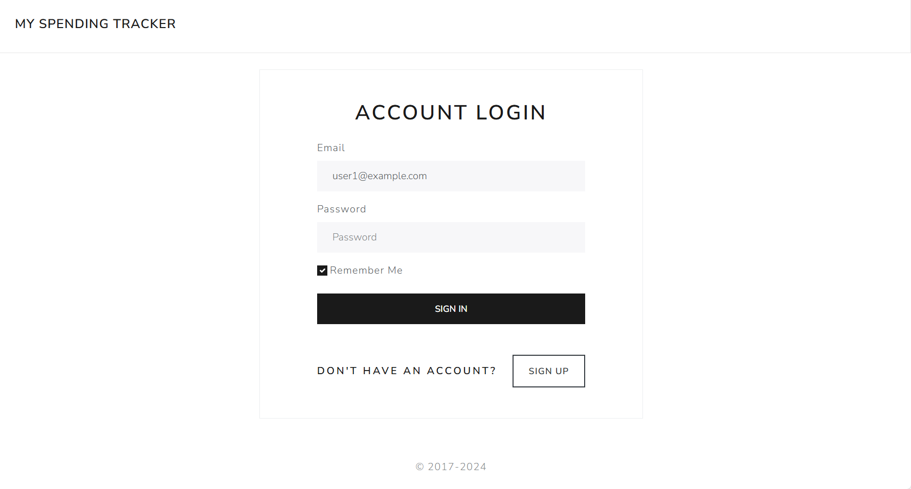
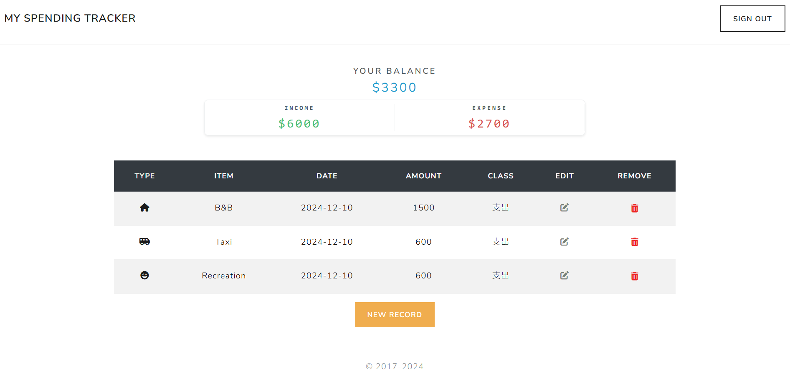
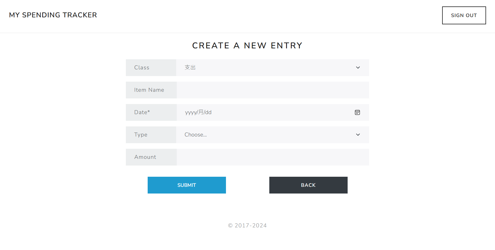
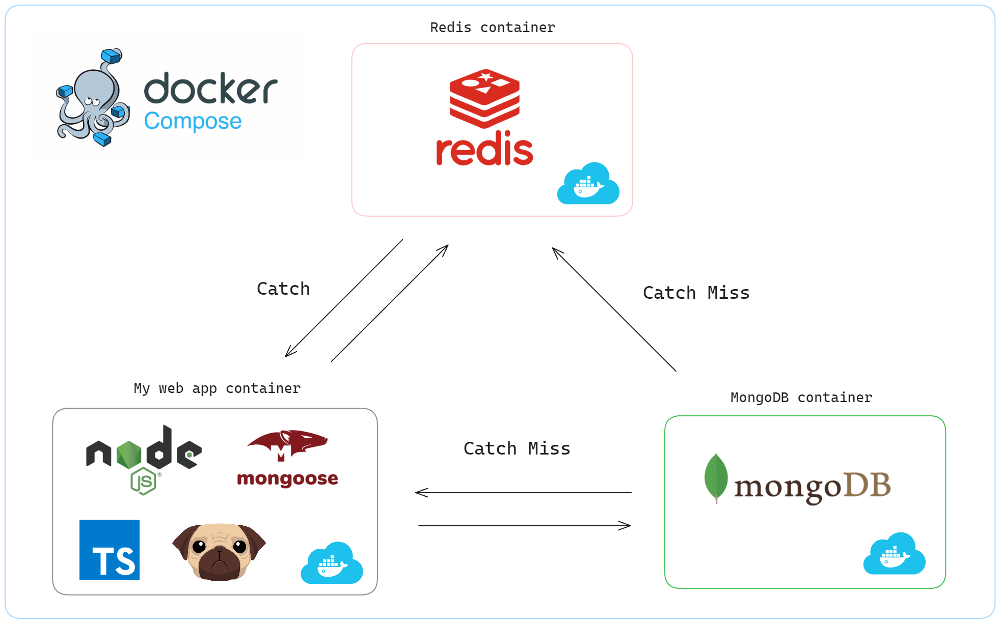

# _Expense-tracker_

這是一個簡易的記帳網頁，方便使用者快速建立出專屬於個人的收支明細。

測試帳號 : `user1@example.com` ， 密碼：`12345678`

## Screenshot

#### Create New Account

#### Log In User

#### Main Page

#### Add New Record

## Features

1. Users can create new accounts.
2. Users can log in to their accounts and view their income and expenditure records.
3. Users can add new income or expense entries.
4. Users can edit existing income or expense entries
5. Users can delete existing income or expense entries.
6. Users can filter income and expense categories by clicking the icon of the type item.
7. Users can opt to have their login credentials remembered for future logins.

 

## Prerequisites

- Node.js
- MongoDB
- Redis

or

- Docker

## System Architecture Diagram(using Docker)

<!-- ## Dependencies

- bcryptjs: "^2.4.3"
- cookie-parser: "^1.4.6"
- dayjs: "^1.11.10"
- dotenv: "^16.4.5"
- express: "^4.19.2"
- express-session: "^1.18.0"
- method-override: "^3.0.0"
- mongoose: "^8.2.4"
- passport: "^0.7.0"
- pug: "^3.0.2"
- redis: "^4.6.13" -->